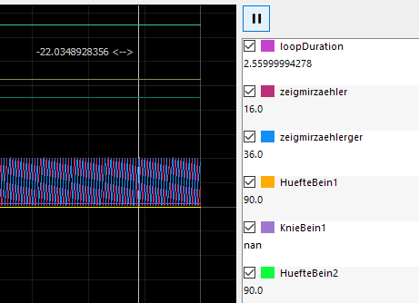

microRay user interface
=======================

The interface is splitted into three parts. The top most section is used for general things like starting or
stopping the communication and for displaying messages to the user.

The second section is where your parameters are displayed.

The third section shows the live plot of your channel values arriving from the microcontroller.

General Control Panel
---------------------

send pending commands and cancel pending commands

Parameter Section
-----------------

show a nice image here

Plot section
------------

If you have a mouse with a scroll wheel position your mouse on the plot to zoom.
If you only want to change the scale of one axis, position your mouse over the axis and turn your scroll wheel.

Use the play / pause button to control the movement of the plot. When you want to analyse a certain position
just pause the movement, drag the white vertical line to the interesting region and zoom as you like. The values
at the vertical line are shown in the channel selection area on the right. The play / pause button does not affect
the communication with the controller, it keeps running in the background.

When you want to hide a channel from the plot, just deselect it in the channel selection area on the right. But when you
want the channel not to be transmitted, maybe because there are too many channels, deselect "active" under
"Projekteinstellungen" -> "Kanaleinstellungen", generate the include files and recompile your code.

